# JUMO 

在RAG实践中，文档解析是一个关键环节，直接影响到后续的知识检索和应用效果。因此，我们在文档解析过程中引入了MinerU进行pdf和图片的解析，结合fastapi和celery构建了一个高并发、高可用的文档解析服务——JUMO。
这个名字来源于《天龙八部》中快速阅读过目不忘的鸠摩智（原型鸠摩罗什）。

## 痛点与挑战

在传统的文档处理过程中有着多挑战：

- **格式繁杂兼容难**：企业文档格式多样，传统工具难以同时高质量处理 Office 文档和复杂的 PDF 扫描件。
- **语义割裂检索差**：简单的按字符切分导致上下文丢失，检索匹配度低，无法满足业务需求。
- **解析效率瓶颈**：面对海量存量文档，缺乏高并发处理能力，响应速度慢，难以支撑大规模应用。

## 技术方案概览

为了解决上述问题，我们构建了一套高性能、可扩展的文档处理架构：

- **全格式支持**：全面覆盖 **Word、Excel、PDF、PPT和图片**等主流办公文档格式。
- **高精度解析**：通过引入MinerU VLM模型实现准确的布局解析和元素提取。
- **跨平台支持**：同时支持**英伟达CUDA和华为CANN框架。**(后续会放出昇腾兼容版)
- **知识库应用优化**：为了更好支持上层应用，解析后增加了智能切分和实体识别功能，增强后续的检索效果。
- **高并发架构设计**：
    - 采用 **FastAPI** 作为服务入口，保障请求的高效接收与响应。
    - 引入 **Celery** 分布式任务队列，实现请求响应与处理过程的完全解耦，有效应对流量洪峰，保障系统稳定性和可用性。
    - **资源利用最大化**：通过创建多组 **Celery Worker**（执行CPU密集任务） + **vLLM Server**（执行GPU密集推理任务），实现对多核CPU+多卡GPU的并行调用，大幅提升单机处理吞吐量。
    - 使用Docker Compose进行服务编排，进行功能切分，保证服务的并发量和性能。

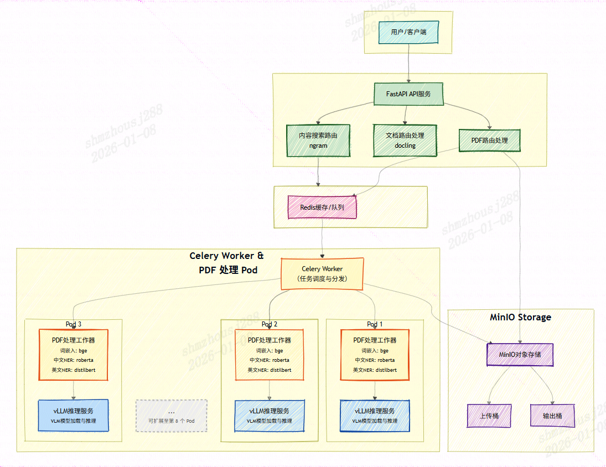

## 核心技术亮点

### 1. 智能表格处理

针对文档中的表格数据，我们提供了两种灵活的转换方式，满足不同应用场景的需求：
* **键值对转换**：将表格行列关系转换为自然语义表达，便于大模型理解和问答。并且**支持合并单元格的处理**，避免生成关系错乱的表格数据。例如，将”产品名称 | 价格 | 库存”的表格转换为”产品名称：A；价格：100元，库存：50件；产品名称：B；价格：150元，库存：30件”等键值对形式。
* **Markdown表格转换**：保持表格的原始结构，转换为标准的Markdown表格格式，便于上层应用中可视化展示。

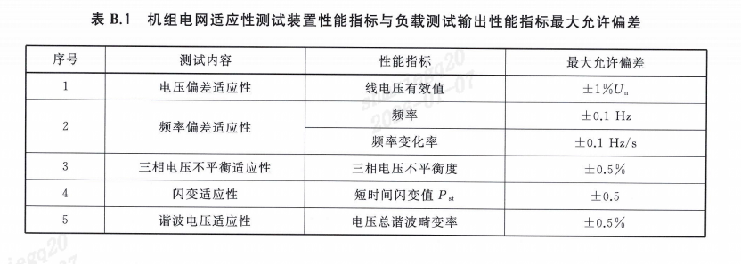

原始表格

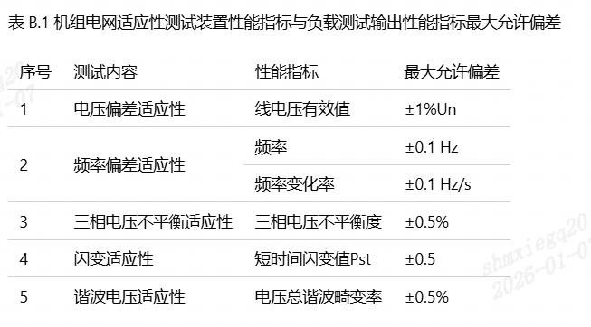

markdown格式表格

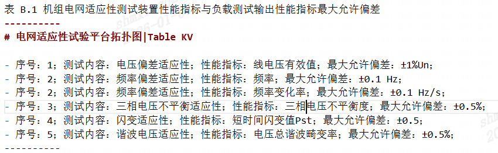

key-value格式表格

此外，**针对过长的表格，支持按照长度切分，在不丢失信息的前提下**适配向量数据库的存储，保证后续的检索效果。

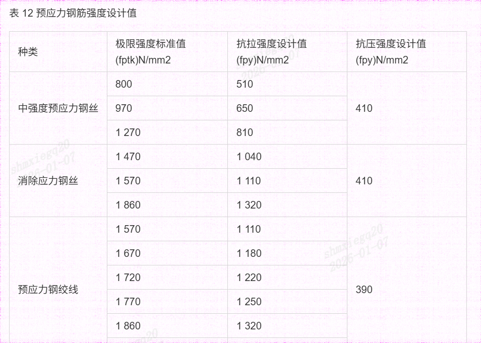

原始表格

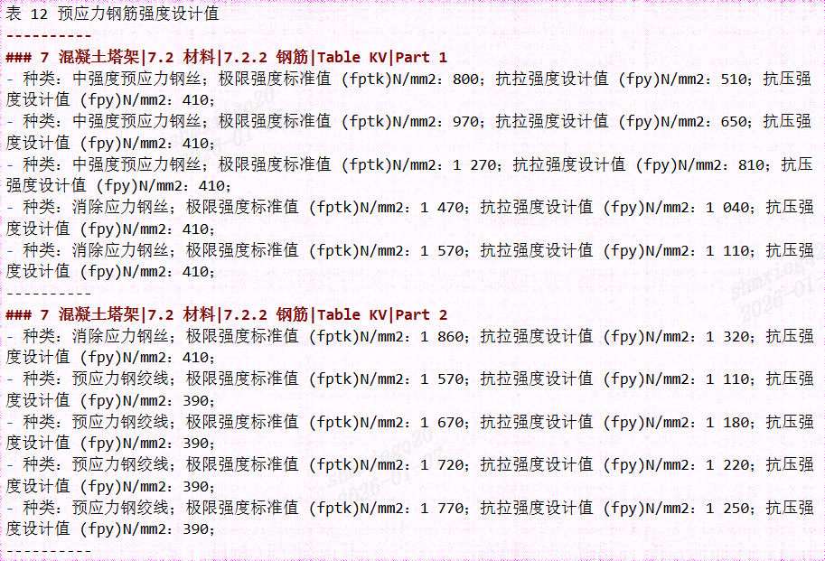

表格切分后

### 2. 基于语义的智能切分

摒弃了传统机械的字数切分方式，我们引入了 **BGE Embedding 模型**。通过计算文本向量并利用相似度聚类算法，将含义紧密相关的段落自动聚合。这种方式确保了每一个数据切片都是一个完整的”语义单元”，大幅提升了后续检索的准确性。与此同时，模型规模为24M，资源占用率极小，对整体解析流程的影响微乎其微。

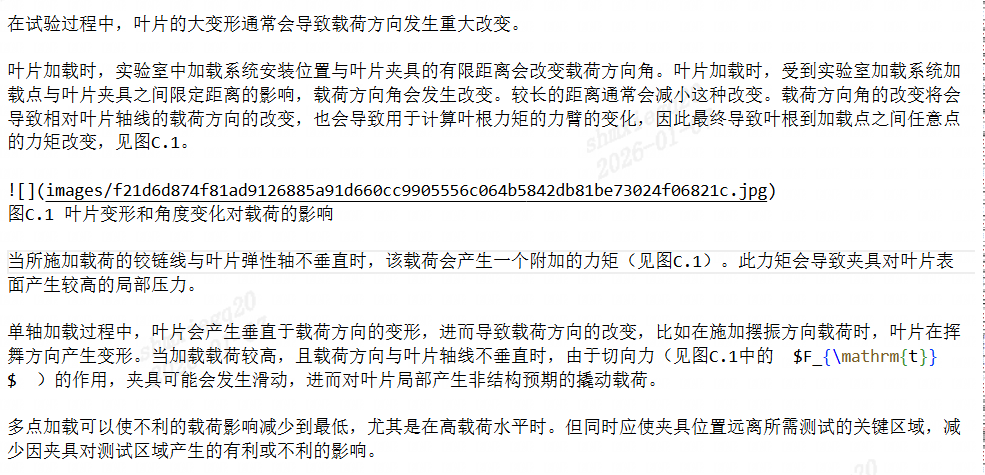

语义切分前1

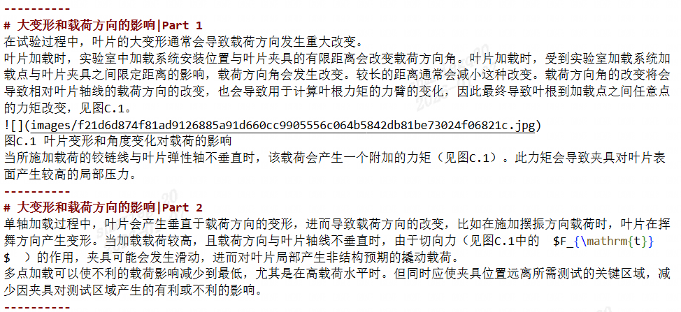

语义切分后2

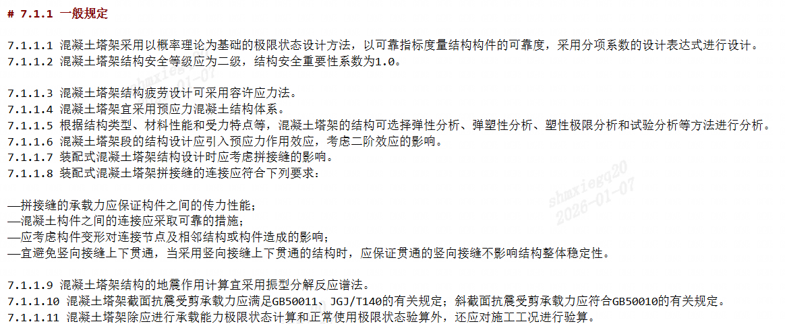

语义切分前2


语义切分后2

### 3. 标题聚合

针对企业长文档层级复杂的特点，我们开发了**标题聚合功能**。系统会自动将多级标题信息聚合到对应的段落中。无论文档如何切分，每个切片都能保留”父级标题-子标题”的完整路径，有效解决了碎片化导致的上下文丢失问题，从而提升了后续检索的准确性和相关性。

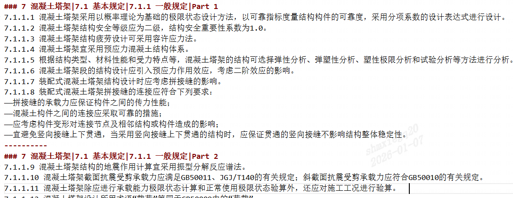

多级标题聚合

### 4. 实体信息提取

为了进一步提升检索效率，集成了中英文的 **NER（命名实体识别）模型**。在解析过程中，系统会自动抽取文档中的组织机构、人名、专有名词等关键实体，为文档打上标签，实现多维度的精准检索。

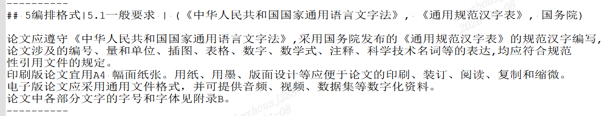

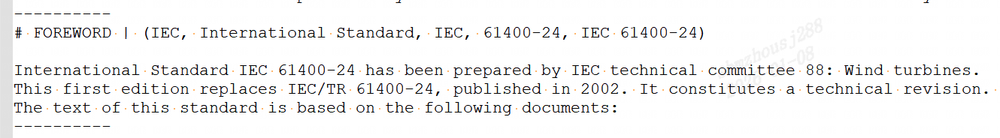

## 部署和启动方式
1. 首先使用提供的dockerfile进行镜像构建
```bash
docker build -t jumo-service:latest .
```
因为要安装的pip包比较多，所以构建过程会比较慢，虽然我已经使用了uv去构建。
2. 完成镜像构建以后，使用docker-compose启动服务
```bash
docker-compose up -d
```
3. 对.env文件进行配置
.env文件中包含了一些必要的配置，例如数据库连接信息、模型路径等。请根据实际情况进行配置。尤其是INFERENCE_DEVICE，需要根据实际的GPU设备号进行配置。程序会根据推理设备的数量和编号来创建对应的worker和vllm实例用于并行处理。

## 使用接口

### POST 分析文件请求

POST /analyze-pdf

#### 请求参数

|Name|Location|Type|Required|Description|
|---|---|---|---|---|
|pdf_path|query|string| yes |文件路径（对应bucket_name指定的bucket中的路径）|
|bucket_name|query|string| yes |读取文件的bucket|
|output_bucket|query|string| yes |输出结果文件的bucket|
|ocr_enabled|query|string| yes |是否开启ocr，如果关闭则传false|
|table_enabled|query|string| yes |是否开启表格识别,如果关闭则传false|
|ocr_lang|query|string| yes |    CH = "ch"|

##### Description

**ocr_lang**:     CH = "ch"
    CH_SERVER = "ch_server"
    CH_LITE = "ch_lite"
    EN = "en"
    KOREAN = "korean"
    JAPAN = "japan"
    CHINESE_CHT = "chinese_cht"
    TA = "ta"
    TE = "te"
    KA = "ka"

> Response Examples

```json
{
  "task_id": "01K0E8BRGW",
  "status": "PROCESSING",
  "message": "任务正在处理"
}
```

样例请求
```bash
curl --location --request POST 'localhost:5116/analyze-pdf?pdf_path=test1.pdf&bucket_name=upload&output_bucket=output&ocr_enabled=true&table_enabled=true&ocr_lang=ch'
```

#### Responses

|HTTP Status Code |Meaning|Description|Data schema|
|---|---|---|---|
|200|[OK](https://tools.ietf.org/html/rfc7231#section-6.3.1)|none|Inline|

#### Responses Data Schema

HTTP Status Code **200**

|Name|Type|Required|Restrictions|Title|description|
|---|---|---|---|---|---|
|» task_id|string|true|none||任务ID|
|» status|string|true|none||任务状态|
|» message|string|true|none||任务状态信息描述|

### GET 获取任务信息

GET /task-status/{task_id}

#### 请求参数

|Name|Location|Type|Required|Description|
|---|---|---|---|---|
|task_id|path|string| yes |在请求分析任务的时候返回的任务ID|

> 任务尚未完成时的响应

```json
{
  "task_id": "01K0E8CP0P",
  "status": "PROCESSING",
  "message": "任务正在处理"
}
```
> 任务已完成时的响应
```json
{
  "task_id": "01K0E8BRGW",
  "status": "COMPLETED",
  "result": {
    "markdown": "01K0E8BRGW/deepseek.md",
    "content_list": "01K0E8BRGW/deepseek_content_list.json",
    "middle_json": "01K0E8BRGW/deepseek_middle.json",
    "images": [
      "01K0E8BRGW/images/ae3b280372957204b1a8a975041a664354462da1919e0ac34ee8926bbcf1ea3b.jpg",
      "01K0E8BRGW/images/e55e41c9be482eec24656880d517cffb3c64a1a5f3caee5055d44424eae5e77f.jpg",
      "..."
    ],
    "splitted_markdown": "01K0E8BRGW/deepseek_splitted.md"
  }
}
```
#### Responses Data Schema

HTTP Status Code **200**

|Name|Type|Required|Restrictions|Title|description|
|---|---|---|---|---|---|
|» task_id|string|true|none||任务ID|
|» status|string|true|none||状态|
|» result|object|true|none||none|
|»» markdown|string|true|none||生成的markdown文件的url|
|»» content_list|string|true|none||content_list的url|
|»» middle_json|string|true|none||middle_json的url|
|»» images|[string]|true|none||文章中所使用的图片的url|
|»» splitted_markdown|string|true|none||切分过的markdown文件url|


